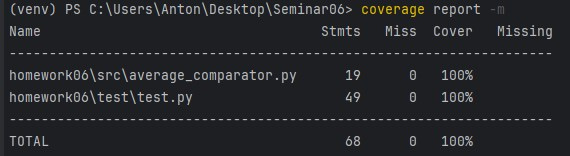

# Отчет о выполненой работе

---

### [Ссылка на код программы]](https://github.com/moiseev-anton/Testing/tree/main/src/homework06/src)
### [Ссылка на код тестов](https://github.com/moiseev-anton/Testing/blob/main/src/homework06/test/test.py)

---
## Отчеты pylint:
 * ***для файла программы***

* ***для файла тестов***

---

## Отчет о покрытии тестами

---
## Пояснение

**Метод find_average** принимает список чисел и возвращает их средннее значение. 
Его выполненение не связано с другими компонентами, поэтому его не надо изолировать.
Покрываем его юнит-тестами и проверяем сценарии:
* для корректного списка
* для пустого списка
* когда в качестве аргумента передан не список (TypeError)
* когда с списке оказались элементы отличного от числа типа

**Метод compare_lists** при выполнении вызывает метод find_average, 
поэтому для замены этих вызовов мы используем patch. Тем самым мы изолируем
метод compare_lists и контролируем значения которые якобы возвращает метод find_average.
Покрываем его юнит-тестами и проверяем сценарии:
* когда средние значения равны
* когда среднее значение первого списка больше
* когда среднее значение второго списка больше

Так как мы контролируем значения которые возвращает метод find_average, то 
не важно какие списки мы передадим методу compare_lists, главное проверить что метод find_average
"вызывался" именно с этими списками.

И проводим интеграционные тесты для проверки взамной работы этих методов.
проверяем сценарии:
* когда средние значения равны
* когда среднее значение первого списка больше
* когда среднее значение второго списка больше
* когда в качестве аргумента передан не список (TypeError)
* когда с списке оказались элементы отличного от числа типа
 
